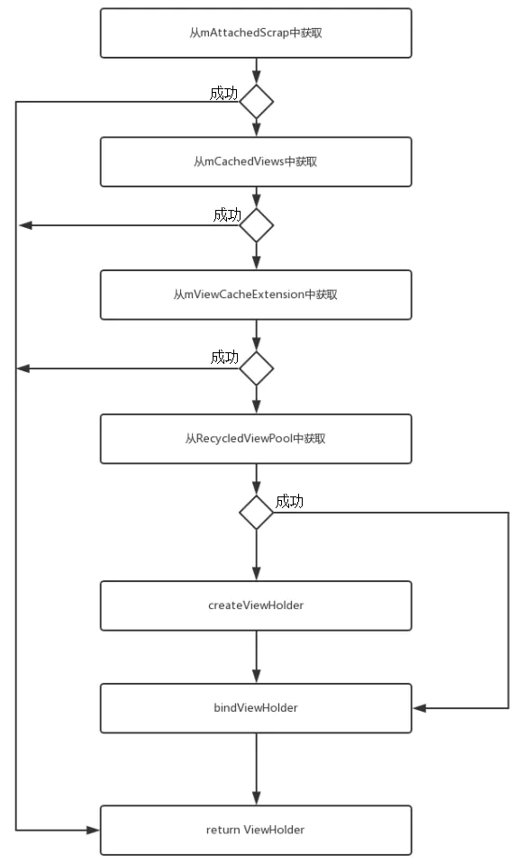

# RecyclerView

使用示例即当前目录中的代码

## 缓存机制

参考地址：https://www.jianshu.com/p/f9e21269da26

首先，RecyclerView的缓存可以分为四级

* 屏幕内缓存
* 屏幕外缓存
* 自定义缓存
* 缓存池

RecyclerView是通过内部类 Recycler 来管理这四级缓存的。

### 一级缓存 屏幕内缓存 (mAttachedScrap)
屏幕内缓存指在屏幕中显示的ViewHolder，这些ViewHolder会缓存在mAttachedScrap、mChangedScrap中 ：

- mChangedScrap 表示数据已经改变的ViewHolder列表，需要重新绑定数据（调用onBindViewHolder）
- mAttachedScrap 未与RecyclerView分离的ViewHolder列表

### 二级缓存 屏幕外缓存 (mCachedViews)

用来缓存移除屏幕之外的 ViewHolder，默认情况下缓存容量是 2，可以通过 setViewCacheSize 方法来改变缓存的容量大小。
如果 mCachedViews 的容量已满，则会优先移除旧 ViewHolder，把旧ViewHolder移入到缓存池RecycledViewPool 中。

### 三级缓存 自定义缓存 (ViewCacheExtension)

给用户的自定义扩展缓存，需要用户自己管理 View 的创建和缓存，可通过Recyclerview.setViewCacheExtension()设置。

### 四级缓存 缓存池 (RecycledViewPool)

ViewHolder 缓存池，在mCachedViews中如果缓存已满的时候（默认最大值为2个），先把mCachedViews中旧的ViewHolder 存入到RecyclerViewPool。
如果RecyclerViewPool缓存池已满，就不会再缓存。
从缓存池中取出的ViewHolder ，需要重新调用bindViewHolder绑定数据。

- 按照 ViewType 来查找 ViewHolder
- 每个 ViewType 默认最多缓存 5 个
- 可以多个 RecyclerView 共享 RecycledViewPool

RecyclerViewPool底层是使用了 * SparseArray * 来分开存储不同ViewType的ViewHolder集合

## 缓存策略

Recyclerview在获取ViewHolder时按四级缓存的顺序查找，如果没找到就创建。
其中只有RecycledViewPool找到时才会调用 onBindViewHolder，其它缓存不会重新bindViewHolder 。

## 优化

- 减少视图嵌套
- 去除冗余的setOnItemClick事件
  - 直接在onBindViewHolder方法中创建一个匿名内部类的方式来实现setOnItemClick是不可取的，这会导致在RecyclerView快速滑动时创建很多对象，
  - 优化方法为：事件的绑定和viewholder对应的rootView进行绑定

- 复用pool缓存
  - 如果存在RecyclerView中嵌套RecyclerView的情况，可以考虑复用RecyclerViewPool缓存池，减少开销
  

## 总结

> 通过了解RecyclerView的四级缓存，
> 我们可以知道，RecyclerView最多可以缓存 N（屏幕最多可显示的item数） + 2 (屏幕外的缓存) + 5*M (M代表M个ViewType，缓存池的缓存)，
> 只有RecycledViewPool找到时才会重新调用 onBindViewHolder。
