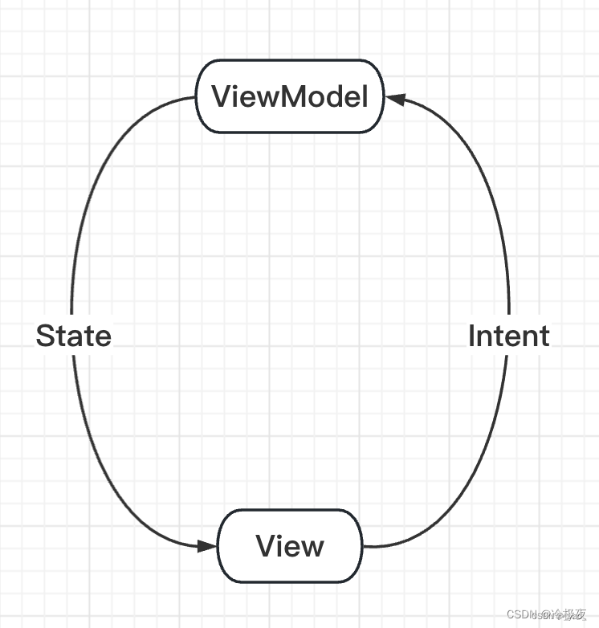

# MVI

MVI 是基于 MVVM 的一种衍化

将 V 与 VM的双向绑定改为单向数据流

MVI即Model-View-Intent，它受Cycle.js前端框架的启发，提倡一种单向数据流的设计思想，非常适合数据驱动型的UI展示项目：

* Model:
  与其他MVVM中的Model不同的是，MVI的Model主要指UI状态（State）。当前界面展示的内容无非就是UI状态的一个快照：例如数据加载过程、控件位置等都是一种UI状态

* View:
  与其他MVX中的View一致，可能是一个Activity、Fragment或者任意UI承载单元。MVI中的View通过订阅Intent的变化实现界面刷新（不是Activity的Intent、后面介绍）

* Intent:
  此Intent不是Activity的Intent，用户的任何操作都被包装成Intent后发送给Model进行数据请求(类似于前端概念中的Action)

## 单向数据流

 
---------

用户操作以Intent的形式通知Model => Model基于Intent更新State => View接收到State变化刷新UI。数据永远在一个环形结构中单向流动，不能反向流动：

* 优点

  - UI的所有变化来自State，所以只需聚焦State，架构更简单、易于调试
  - 数据单向流动，很容易对状态变化进行跟踪和回溯
  - state实例都是不可变的，确保线程安全
  - UI只是反应State的变化，没有额外逻辑，可以被轻松替换或复用

* 缺点

  - 所有的操作最终都会转换成State，所以当复杂页面的State容易膨胀
  - state是不变的，每当state需要更新时都要创建新对象替代老对象，这会带来一定内存开销
  - 有些事件类的UI变化不适合用state描述，例如弹出一个toast或者snackbar
