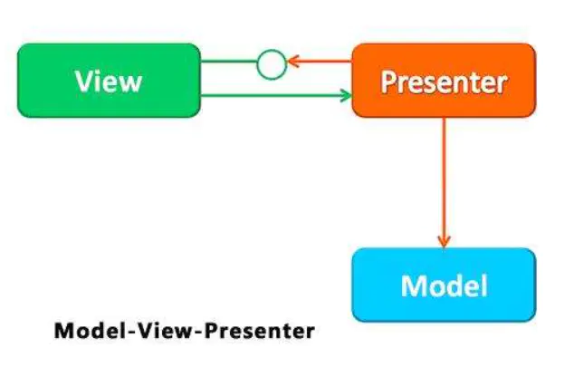

# MVP

MVP模式的出现就是为了解决MVC的问题的，MVP使用Presenter代替了之前的Controller层，

* M
  * Model（模型层），数据处理部分，对应数据库和网络请求数据的操作，和MVC中一样。

* V
  * View（视图层），视图显示部分，对应应用程序中的Activity、Fragment，这点不同于MVC。

* P
  * Presenter：View层和Model完全分离，它是Model和View通信的桥梁。它从Model层中检索数据后通知View进行视图更新，接收用户事件通知Model层去操作数据。

MVP直接的引用情况如图所示

V层持有P层的引用，P层持有 View层接口实现的引用，同时P层持有M层的引用

V层不能直接调用M层，只能通过P层转发

所以说 Presenter 是MVP的桥梁

## 优缺点

* 优点
  * 1、根据职责来划分模块，结构清晰，而且做到了View层和Model的完全分离，代码便于维护。
  * 2、相比于MVC，减轻了Activity的职责。

* 缺点
  * 1、需要定义过多的类和接口，容易造成类膨胀问题。
  * 2、很难进行复用，如果View发生变化，就需要修改View的接口，那么Presenter层可能也需要进行修改。
  * 3、内存泄漏和空指针问题，由于P层持有V层的引用，当页面关闭后P层仍有耗时任务在执行就很容易造成内存泄漏和空指针。
  * 4、Activity本身是一个Context，无论怎么封装都难免将业务逻辑加入其中。